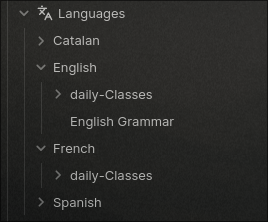

# NGZZ TEACHER
---
Ngzz teacher is an AI-powered teacher runned by ollama v3 from Meta, Its light-weight and perfect for obsidian run-time.
Once you choose the folder you want:

Line 18:
```py
BASE_SAVE_DIR = "your/path/folder/to/store"
```
example:
```py
BASE_SAVE_DIR = /home/ngzz/Documents/Notepad/Main/01_Knowledge/Languages
```

It will create a folder like the one I'm about to show u



#### Note:
> You don't need to create a folder for the language you want to learn. It creates itself.

### Choosing the language
Line 11:
```LANGUAGE = "French"```
Or any Other language, you want.

---

## How to use

Once you run the program.py

Python program.py.
You will **Generate New lesson** by pressin on the top button.
then You will must write your answer on the "answer:" line.
then check your answer.

